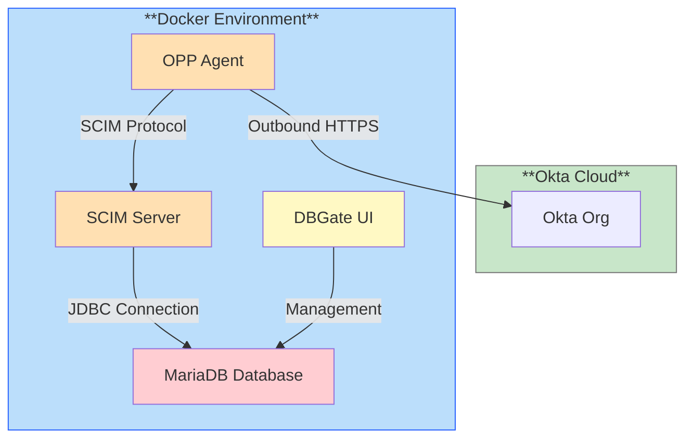

# 🗄️ Okta Generic Database Connector (JDBC) Lab Environment

A Docker-based laboratory environment for testing Okta's On-Premises Provisioning (OPP) Agent with database connectivity. This setup enables you to quickly deploy and test user provisioning workflows between Okta and on-premises databases (MySQL, MariaDB, PostgreSQL, etc.) using the SCIM protocol.

[](LICENSE)
[](https://docs.docker.com/compose/)

> 🚀 **Quick Start**: See [QUICKSTART.md](QUICKSTART.md) for fast setup instructions.

> ⚠️ **Warning**: **Docker** is not officially supported by Okta to run the OPP Agent and SCIM Server in production. Always consult official Okta documentation and support for production deployments. This environment is for testing and demonstration purposes only.
> 📢 **Note**: This lab environment is designed for testing and demonstration purposes. For production deployments, consult the [official Okta documentation](https://help.okta.com/en-us/content/topics/provisioning/opc/connectors/on-prem-connector-generic-db.htm).

## 📋 Table of Contents

- [Quick Start Guide](QUICKSTART.md) - Fast setup in minutes
- [Overview](#-overview)
  - [What is the Okta Generic Database Connector (JDBC)?](#what-is-the-okta-generic-database-connector-jdbc)
  - [What is the Okta On-Premises Provisioning Agent?](#what-is-the-okta-on-premises-provisioning-agent)
  - [What is the Okta On-prem SCIM Server?](#what-is-the-okta-on-prem-scim-server)
  - [How they works together](#how-they-works-together)
  - [Lab Components](#lab-components)
  - [Architecture](#architecture)
- [Prerequisites](#-prerequisites)
- [Quick Start](#-quick-start)
- [Configuration](#-configuration)
  - [Environment Variables](#environment-variables)
  - [Database Initialization](#database-initialization)
  - [OPP Agent Configuration](#opp-agent-configuration)
  - [SCIM Server Configuration](#scim-server-configuration)
- [Database Management](#-database-management)
- [Makefile Commands](#-makefile-commands)
- [Troubleshooting](#-troubleshooting)
- [Security & Production Considerations](#-security--production-considerations)
- [Using Different Databases](#-using-different-databases)
- [Resources](#-resources)
- [License](#-license)
- [Author](#-author)

## 🎯 Overview

### What is the Okta Generic Database Connector (JDBC)?

The Okta Generic Database Connector (JDBC) allows Okta to connect to on-premises databases using JDBC drivers. It enables user provisioning and de-provisioning, as well as entitlement management, by executing SQL queries or stored procedures against the database. This is particularly useful for organizations that have legacy applications or custom databases that do not support modern provisioning protocols but can be accessed via JDBC.

It works as an additional component (SCIM Server) that integrates with the Okta On-Premises Provisioning Agent to facilitate secure communication between Okta and the on-premises database.

### What is the Okta On-Premises Provisioning Agent?

The Okta On-Premises Provisioning (OPP) Agent acts as a secure bridge between Okta's cloud identity platform and your on-premises applications. It enables:

- **Automated User Provisioning**: Create, update, and deactivate user accounts in on-premises databases
- **SCIM Protocol Support**: Industry-standard protocol for user identity management
- **Secure Communication**: Outbound-only HTTPS connections from your network to Okta
- **Real-time Synchronization**: Push user changes from Okta to on-premises systems

### What is the Okta On-prem SCIM Server?

The Okta On-prem SCIM Server is a Java-based application that translates SCIM API calls from the OPP Agent into database operations using JDBC. It serves as the intermediary layer that allows Okta to manage user accounts in your on-premises database through the SCIM protocol.

### How they works together

1. **Okta to Okta Provisioning Agent**: The Provisioning Agent maintains a secure outbound connection from behind your firewall to the Okta cloud using long polling. Since the connection originates from within your network perimeter, no inbound firewall rules are required.

2. **Okta Provisioning Agent to Okta On-prem SCIM Server**: When lifecycle management or provisioning requests arrive from Okta, the Agent relays them to the co-located SCIM Server (Generic Database Connector) for processing.

3. **Okta On-prem SCIM Server to Database System**: The SCIM Server interprets incoming requests and executes the corresponding database operations—creating users, modifying attributes, deactivating accounts, or managing entitlements—directly against your on-premises database.

4. **Data Flow Back**: Response data and import information return through the same path in reverse: from the database to the SCIM Server, then to the Provisioning Agent, which securely transmits the results back to Okta.

This architecture ensures secure, outbound-only communication with the Agent handling all Okta interactions while the SCIM Server manages local database operations. You have deployment flexibility—both components can run on the same host or distributed across separate servers based on your security and architectural requirements. This lab environment uses separate containers to simulate a production-like deployment pattern.

### Lab Components

This Docker Compose environment includes four separate containers:

1. **Okta Provisioning Agent (okta-opp)**: Maintains secure connection to Okta
2. **Okta On-Prem SCIM Server (okta-scim)**: Translates SCIM requests to database operations
3. **MariaDB (db)**: Sample database for testing provisioning with pre-populated test data
4. **DBGate**: Web-based database management interface

### Architecture



## 📦 Prerequisites

Before starting, ensure you have:

- **Docker Desktop** or **Docker Engine** with Docker Compose v2+
- **Okta Organization** with administrative access
- **Required Files** downloaded (see below)

### Required Files

The project now uses separate directories for OPP Agent and SCIM Server packages:

**For OPP Agent** - Place in `./docker/okta-opp/packages/`:

| File | Required | Description | Download |
|------|----------|-------------|----------|
| `OktaProvisioningAgent-*.rpm` | Yes | OPP Agent installer | [Download from Okta](https://help.okta.com/oie/en-us/content/topics/provisioning/opp/opp-install-agent.htm) |
| `*.pem` or `*.crt` (certificates) | No | Custom VPN certificates | Copy your VPN provider root CA |

**For SCIM Server** - Place in `./docker/okta-scim/packages/`:

| File | Required | Description | Download |
|------|----------|-------------|----------|
| `OktaOnPremScimServer-*.rpm` | Yes | SCIM Server installer | [Download from Okta](https://help.okta.com/oie/en-us/content/topics/provisioning/opp/on-prem-scim-install.htm) |
| `*.jar` (JDBC drivers) | No | Additional database drivers (optional) | MySQL Connector/J is auto-downloaded. For other databases: [PostgreSQL](https://jdbc.postgresql.org/), [Oracle](https://www.oracle.com/database/technologies/appdev/jdbc-downloads.html), [SQL Server](https://learn.microsoft.com/en-us/sql/connect/jdbc/download-microsoft-jdbc-driver-for-sql-server) |
| `*.pem` or `*.crt` (certificates) | No | Custom VPN certificates | Copy your VPN provider root CA |

> ℹ️ **Info**: Certificate files are only needed if you're connecting through a VPN with custom CA certificates (e.g., Palo Alto GlobalProtect, Prisma Access). If you don't have custom VPN certificates, you can ignore the warnings during startup.

## 🚀 Quick Start

### 1. Prepare Required Files

```bash
# Copy OPP Agent Install files to docker/okta-opp/packages/:
# - OktaProvisioningAgent-*.rpm
# - *.pem or *.crt (optional, for custom VPN)

# Copy SCIM Server Install files to docker/okta-scim/packages/:
# - OktaOnPremScimServer-*.rpm (required)
# - *.jar files for additional databases (optional - MySQL Connector/J auto-downloaded)
# - *.pem or *.crt (optional, for custom VPN)
```

### 2. Configure Environment

```bash
# Copy sample environment file
cp .env-sample .env

# Edit if needed (default values work for testing)
nano .env
```

### 3. Build and Start

```bash
# Build Docker images
make build

# Start services
make start-logs # (or `make start` for detached mode)
```

The `make start` command will:
- Run prerequisite checks
- Start all containers

### 4. Configure OPP Agent

Wait for this message in the logs:
```
⏳ Waiting for configuration files. Please configure the Agent...
```

Then, open another terminal (or close the logs with `CTRL+C`), and configure the agent:

```bash
make configure
```

You will see the message:

```txt
... [INFO] - Register Mode successfully finished

Configuration successful.

Service can now be started by typing
systemctl start OktaProvisioningAgent.service
as root.
```

You don't need to run the `systemctl` command since the agent is already running in the container. The message indicates that the configuration files have been generated successfully.

### 5. Retrieve SCIM Credentials

After the SCIM server starts, the credentials are automatically displayed in the logs. You can also retrieve them from:

**Option A: From host filesystem**
```bash
# API Token (look for scim.security.bearer.token property)
cat ./data/okta-scim/conf/config-*.properties | grep bearer.token

# Public Certificate
cat ./data/okta-scim/certs/OktaOnPremScimServer-*.crt
```

**Option B: From container**
```bash
# Display credentials
docker compose exec okta-scim /opt/OktaOnPremScimServer/bin/Get-OktaOnPremScimServer-Credentials.sh

# Public Certificate
docker compose exec okta-scim bash -c 'cat /opt/OktaOnPremScimServer/certs/OktaOnPremScimServer-*.crt'
```

### 6. Configure Okta App Integration

**Detailed Configuration Guide**: See **[doc/Okta_Provisioning_Configuration.md](doc/Okta_Provisioning_Configuration.md)** for step-by-step instructions on configuring import and provisioning operations, among with entitlements management.

**Official Documentation**: https://help.okta.com/oie/en-us/content/topics/provisioning/opc/connectors/on-prem-connector-generic-db.htm

## ⚙️ Configuration

### Environment Variables

The `.env` file configures the MariaDB database and SCIM Server logging:

**Database Configuration**:

```bash
MARIADB_PORT=3306              # Database port
MARIADB_DATABASE=oktademo      # Database name
MARIADB_USER=oktademo          # Database user
MARIADB_PASSWORD=oktademo      # Database password
MARIADB_ROOT_PASSWORD=oktademo # Root password
```

**SCIM Server Logging Configuration**:

```bash
# Valid values: TRACE, DEBUG, INFO, WARN, ERROR, FATAL, OFF
LOG_LEVEL_ROOT=INFO              # Root logging level
LOG_LEVEL_SPRING_WEB=WARN        # Spring Web framework
LOG_LEVEL_CATALINA=WARN          # Apache Catalina (Tomcat servlet container)
LOG_LEVEL_COYOTE=WARN            # Apache Coyote (Tomcat HTTP connector)
LOG_LEVEL_TOMCAT=WARN            # Apache Tomcat
LOG_LEVEL_HIKARI=WARN            # HikariCP connection pool
LOG_LEVEL_OKTA_SCIM=INFO         # Okta SCIM Server application
LOG_LEVEL_SPRING_JDBC=INFO       # Spring JDBC (database operations)
```

> 💡 **Tip**: For troubleshooting database connection or SCIM operations, set `LOG_LEVEL_OKTA_SCIM=DEBUG` and `LOG_LEVEL_SPRING_JDBC=DEBUG` to see detailed logs.

### Database Initialization

The database is automatically initialized on first startup with:

**Schema and Test Data** (`sql/init.sql`):
- **USERS** table: Comprehensive user profiles with fields
  - **Identity**: `USER_ID` (PRIMARY KEY), `USERNAME` (UNIQUE), `EMAIL` (NOT NULL)
  - **Personal**: `FIRSTNAME`, `LASTNAME`, `MIDDLENAME`, `HONORIFICPREFIX`, `DISPLAYNAME`, `NICKNAME`, `BIRTHDATE`
  - **Contact**: `MOBILEPHONE`, `STREETADDRESS`, `CITY`, `STATE`, `ZIPCODE`, `COUNTRYCODE`, `POSTALADDRESS`, `TIMEZONE`, `EMERGENCYCONTACT`
  - **Work**: `TITLE`, `DEPARTMENT`, `EMPLOYEENUMBER`, `MANAGER`, `MANAGERID`, `WORKLOCATION`, `COSTCENTER`
  - **Dates**: `HIREDATE`, `TERMINATIONDATE`
  - **Security**: `PASSWORD_HASH`, `IS_ACTIVE` (BOOLEAN)
- **ENTITLEMENTS** table: Access entitlements
  - `ENT_ID` (PRIMARY KEY), `ENT_NAME`, `ENT_DESCRIPTION`
- **USERENTITLEMENTS** table: Junction table for user-entitlement mappings
  - `USERENTITLEMENT_ID` (PRIMARY KEY), `USER_ID`, `ENT_ID`, `ASSIGNED_DATE`
- **Test Data**: 15 Star Wars-themed users from LDIF with realistic job roles, departments, and entitlement assignments

**Stored Procedures** (`sql/stored_proc.sql`):
The following procedures are available for SCIM operations with support for all 31 user fields:
1. `GET_ACTIVEUSERS()` - Retrieve all active users with all fields
2. `GET_USER_BY_ID(p_user_id)` - Query specific user with all fields
3. `CREATE_USER(...)` - Provision new user (30 parameters)
   - **Mandatory**: p_user_id, p_username, p_firstname, p_lastname, p_email
   - **Optional**: All other fields (can be NULL)
4. `UPDATE_USER(...)` - Modify existing user (30 parameters)
   - **Mandatory**: p_user_id, p_username, p_firstname, p_lastname, p_email
   - **Optional**: All other fields (can be NULL)
5. `ACTIVATE_USER(p_user_id)` - Set user active
6. `DEACTIVATE_USER(p_user_id)` - Deactivate user account
7. `GET_ALL_ENTITLEMENTS()` - List all available entitlements
8. `GET_USER_ENTITLEMENT(p_user_id)` - Get user's entitlements with username
9. `ADD_ENTITLEMENT_TO_USER(...)` - Assign entitlement to user
10. `REMOVE_ENTITLEMENT_FROM_USER(...)` - Revoke entitlement from user

> 📖 **Reference**: These stored procedures are based on the Oracle examples from Appendix A of the Generic Database Connector documentation, adapted for MySQL/MariaDB.

### OPP Agent Configuration

The agent configuration is stored in `./data/okta-opp/conf/OktaProvisioningAgent.conf`:

```properties
orgUrl = https://your-org.okta.com
agentId = your-agent-id
agentKey = your-agent-key
keystoreKey = your-keystore-key
keyPassword = your-key-password
env = preview  # or 'prod'
subdomain = your-subdomain
```

> 📢 **Note**: These values are generated during agent registration in the Okta Admin Console. You don't need to change them.
> Use the `make configure` if you need to re-register the angent.

### SCIM Server Configuration

SCIM Server configuration is automatically generated and stored in `./data/okta-scim/`:

**Configuration Locations**:
- **Properties**: `./data/okta-scim/conf/config-*.properties` - Spring Boot configuration
- **Certificates**: `./data/okta-scim/certs/OktaOnPremScimServer-*.crt` - Auto-generated public certificate
- **Private Keys**: `./data/okta-scim/certs/OktaOnPremScimServer-*.key` - Auto-generated private key
- **Keystores**: `./data/okta-scim/certs/OktaOnPremScimServer-*.p12` - PKCS12 keystore
- **Logs**: `./data/okta-scim/logs/` - SCIM Server application logs


> 📢 **Note**: The SCIM server automatically generates a 4096-bit RSA key pair and self-signed certificate on first startup.
> The configuration file is overwritten at every restart of the container, so manual changes will not persist. To change the configuration, you can either:
> 1. Update the `docker-compose.yml` to mount a custom configuration file (make sure to include all required properties)
> 2. Use environment variables to override specific properties (e.g., logging levels)

> 📖 **Advanced**: For detailed technical information about the SCIM Server's internal architecture, API endpoints, and direct API testing, see [doc/Okta_SCIM_Server.md](doc/Okta_SCIM_Server.md).


## 🗄️ Database Management

### Pre-Populated Test Data

The database is automatically initialized with:
- **15 Star Wars characters** as test users (Luke Skywalker, Leia Organa, Han Solo, etc.)
- **10 entitlements** (VPN Access, GitHub Admin, AWS Console, Jira Admin, etc.)
- **Realistic entitlement assignments** based on job roles (Senior Dev, Manager, DevOps Engineer patterns)

### Access DBGate (Web Interface)

1. Open your browser to http://localhost:8090
2. The MariaDB connection is pre-configured:
   - **Host**: db
   - **Database**: oktademo
   - **User**: root
   - **Password**: oktademo (from MARIADB_ROOT_PASSWORD)

### Command Line Access

```bash
# Connect to MariaDB
docker compose exec db mariadb -u oktademo -poktademo oktademo

# View all databases
SHOW DATABASES;

# View tables
SHOW TABLES;

# View test users
SELECT USER_ID, FIRSTNAME, LASTNAME, EMAIL, TITLE FROM USERS LIMIT 10;

# View entitlements
SELECT * FROM ENTITLEMENTS;

# Test a stored procedure
CALL GET_ACTIVEUSERS();

# Get user's entitlements
CALL GET_USER_ENTITLEMENT('luke.skywalker@galaxy.local');
```

## 🛠️ Makefile Commands

| Command | Description |
|---------|-------------|
| `make help` | Display all available commands |
| `make check-prereqs` | Run prerequisite checks without starting services |
| `make build` | Build Docker images (with prereq checks) |
| `make rebuild` | Force rebuild from scratch (no cache) |
| `make start` | Start services in detached mode (with prereq checks) |
| `make start-live` | Start services in foreground mode |
| `make start-logs` | Start services and follow logs |
| `make stop` | Stop and remove all containers |
| `make restart` | Restart all services |
| `make restart-logs` | Restart and follow logs |
| `make logs` | Follow container logs (last 500 lines) |
| `make kill` | Kill containers and remove orphans |
| `make configure` | Launch interactive agent configuration script |

### Example Workflow

```bash
# Initial setup
make build
make start
make configure

# Start
make start

# Stop
make stop

# Restart
make restart

# Rebuild images (i.e. update of the RPM)
make stop
make rebuild
make start

# Clean everything and start from scratch
make stop
rm -rf ./data/okta-opp ./data/okta-scim ./data/mysql
make rebuild
make start
make configure
```

## 🔧 Troubleshooting

### Prerequisite Check Failures

**Missing RPM files**:
```
ERROR: Okta Provisioning Agent RPM not found!
```
**Solution**: Download the RPM files from Okta and place in:
- OPP Agent: `./docker/okta-opp/packages/`
- SCIM Server: `./docker/okta-scim/packages/`

**JDBC driver info message**:
```
INFO: JDBC driver JAR files not found! The MySQL JDBC driver will be downloaded automatically during build.
```
**Note**: This is informational only. MySQL Connector/J is automatically downloaded during build. You only need to manually add JDBC drivers for other databases (PostgreSQL, Oracle, SQL Server, etc.)

### Agent Not Starting

**Symptoms**: Agent shows "Waiting for configuration files..."

**Solution**: Ensure these files exist in `./data/okta-opp/`:
- `conf/OktaProvisioningAgent.conf` with all required keys
- `security/OktaProvisioningKeystore.p12`

**Check logs**:
```bash
# View OPP Agent logs
docker compose logs -f okta-opp

# View agent log file directly
tail -f ./data/okta-opp/logs/agent.log
```

### SCIM Server Connection Failed

**Check SCIM logs**:
```bash
# View SCIM Server container logs
docker compose logs -f okta-scim

# View SCIM Server application logs
tail -f ./data/okta-scim/logs/*.log
```

**Common issues**:
1. **Wrong JDBC URL**: Verify database host is `db` (not `localhost`)
2. **Missing drivers for non-MySQL databases**: If using PostgreSQL/Oracle/SQL Server, ensure appropriate `.jar` files are in `./docker/okta-scim/packages/` (MySQL Connector/J is auto-downloaded)
3. **Database not ready**: Check database health with `docker compose ps db`
4. **Bearer token format**: Ensure you added `Bearer ` prefix when configuring the Okta app

### Database Connection Issues

**Test database connectivity**:
```bash
# Check database health
docker compose ps db

# From host
docker compose exec db mariadb-admin ping

# From SCIM container
docker compose exec okta-scim mariadb -h db -u oktademo -poktademo oktademo

# Verify test data loaded
docker compose exec db mariadb -u oktademo -poktademo oktademo -e "SELECT COUNT(*) FROM USERS;"
```

### Certificate Warnings

```
WARNING: No certificate file (.pem or .crt) found
```
**This is normal**: The warning indicates the containers will work without custom VPN certificates. Only add certificates if you're connecting through a VPN with custom CAs (e.g., Prisma Access, GlobalProtect).

**If you need certificates**: Place `*.pem` or `*.crt` files in both:
- `./docker/okta-opp/packages/`
- `./docker/okta-scim/packages/`

### Enabling Database Query Logging

To debug and monitor SQL queries executed by the Okta provisioning system, enable MariaDB's general query log to see all SQL statements received by the server.

#### Enable Query Logging (Temporary - Runtime)

Enable query logging for the current database session without restarting containers:

```bash
# Connect to database and enable general log
docker compose exec db mariadb -u root -p${MARIADB_ROOT_PASSWORD:-oktademo} -e "SET GLOBAL general_log = 'ON';"
docker compose exec db mariadb -u root -p${MARIADB_ROOT_PASSWORD:-oktademo} -e "SET GLOBAL general_log_file = '/var/log/mysql/general.log';"

# Verify logging is enabled
docker compose exec db mariadb -u root -p${MARIADB_ROOT_PASSWORD:-oktademo} -e "SHOW VARIABLES LIKE 'general_log%';"
```

This will enable logging until the container is restarted.

#### Enable Query Logging (Permanent)

To enable query logging permanently, modify the [docker-compose.yml](docker-compose.yml) file to add command-line options to the MariaDB container:

```yaml
services:
  db:
    image: mariadb:11-alpine
    command:
      - --general-log=1
      - --general-log-file=/var/log/mysql/general.log
    # ... rest of configuration
```

After modifying `docker-compose.yml`, restart the database:

```bash
make restart
```

#### View Query Logs

**Real-time monitoring**:
```bash
# Follow the general query log in real-time
docker compose exec db tail -f /var/log/mysql/general.log
```

**View recent queries**:
```bash
# Show last 100 lines
docker compose exec db tail -n 100 /var/log/mysql/general.log

# Search for specific queries (e.g., stored procedures)
docker compose exec db grep "CALL" /var/log/mysql/general.log

# Search for CREATE_USER operations
docker compose exec db grep "CREATE_USER" /var/log/mysql/general.log

# Search for UPDATE_USER operations
docker compose exec db grep "UPDATE_USER" /var/log/mysql/general.log
```

#### Disable Query Logging

To disable query logging and reduce overhead:

```bash
docker compose exec db mariadb -u root -p${MARIADB_ROOT_PASSWORD:-oktademo} -e "SET GLOBAL general_log = 'OFF';"
```

#### Log File Location

- **Inside container**: `/var/log/mysql/general.log`
- **Note**: By default, this log file is NOT persisted to the host filesystem
- **To persist logs**: Add a volume mount in `docker-compose.yml`:

```yaml
services:
  db:
    # ... existing configuration
    volumes:
      - ./data/mysql:/var/lib/mysql
      - ./data/mysql-logs:/var/log/mysql  # Add this line
```

Then create the directory and restart:
```bash
mkdir -p ./data/mysql-logs
make restart
```

#### Performance and Security Considerations

> ⚠️ **Important**: The general query log can generate significant I/O and disk usage in production environments:
> - **Log file growth**: All queries are logged, including SELECT statements
> - **Performance impact**: Writing to the log file adds overhead to every query
> - **Disk space**: Log files can grow rapidly with high query volume
> - **Security**: Logs may contain sensitive information (e.g., user data, SQL statements, PII) - consider this if enabling in production

---

## 🔒 Security & Production Considerations

> ⚠️ **Warning**: This lab uses default credentials for simplicity. **Do not use in production.**


> ⚠️ **Warning**: **Docker** is not officially supported by Okta to run the OPP Agent and SCIM Server in production. Always consult official Okta documentation and support for production deployments. This environment is for testing and demonstration purposes only.

### For Production Deployments

- **Supported Operating Systems**: Use supported OS for OPP Agent and SCIM Server
- **Strong Passwords**: Use complex, unique passwords
- **Use dedicated service accounts** with minimal permissions
- **Network Security**:
   - Isolate the OPP agent in a secure network segment
   - Use firewall rules to restrict database access
- **Certificate Management**: Use proper SSL/TLS certificates
- **Monitoring**: Enable logging and alerting
- **Regular Updates**: Keep agents and databases patched
- **Backup Strategy**: Implement regular database backups
- **High Availability**: Consider redundancy and health checks for critical components

## 🚀 Using Different Databases

To use PostgreSQL instead of MariaDB:

1. Update `docker-compose.yml`:
   ```yaml
   db:
     image: postgres:16 # Use official PostgreSQL image
     # Update environment variables accordingly
   ```
2. Change sql mountpoint to load appropriate initialization scripts for PostgreSQL
3. Place appropriate JDBC driver in `./docker/okta-scim/packages/`:

### Other JDBC Drivers

For other databases (Oracle, SQL Server, etc.):

1. Download appropriate JDBC driver
2. Place `.jar` file in `./docker/okta-scim/packages/`
3. Rebuild the container: `make rebuild`
4. Configure SCIM Server with database-specific connection string

**Note**: MySQL Connector/J 9.6.0 is automatically downloaded from Maven Central during build. All `.jar` files in `./docker/okta-scim/packages/` are copied to `/opt/OktaOnPremScimServer/userlib/` during container build.

## 📚 Resources

### Official Documentation

- [On-premises Connector for Generic Databases](https://help.okta.com/oie/en-us/content/topics/provisioning/opc/connectors/on-prem-connector-generic-db.htm)
- [Install the Okta Provisioning Agent](https://help.okta.com/oie/en-us/content/topics/provisioning/opp/opp-install-agent.htm)
- [Install the Okta On-prem SCIM Server](https://help.okta.com/oie/en-us/content/topics/provisioning/opp/on-prem-scim-install.htm)


### Technical Documentation

- **[Okta Provisioning Configuration Guide](doc/Okta_Provisioning_Configuration.md)** - Step-by-step Okta Admin Console setup instructions
- **[Okta SCIM Server Technical Documentation](doc/Okta_SCIM_Server.md)** - Advanced technical reference for the SCIM Server's internal architecture, API endpoints, and troubleshooting (*reverse-engineered, educational purposes only*)

### SCIM Protocol

- [SCIM 2.0 RFC 7644](https://datatracker.ietf.org/doc/html/rfc7644)
- [Okta SCIM Documentation](https://developer.okta.com/docs/concepts/scim/)

### Community

- [Okta Developer Forums](https://devforum.okta.com/)
- [Okta Community](https://support.okta.com/community/)

## 📝 License

This project is licensed under the Apache License 2.0 - see the [LICENSE](LICENSE) file for details.

## 👤 Author

**Fabio Grasso**
- Blog: [iam.fabiograsso.net](https://iam.fabiograsso.net)
- GitHub: [@fabiograsso](https://github.com/fabiograsso)

---

### Disclaimer

This is a demonstration laboratory environment designed for testing and demonstration purposes. It is not officially supported by Okta for production use. Always consult [official Okta documentation](https://help.okta.com/en-us/content/topics/provisioning/opc/connectors/on-prem-connector-generic-db.htm) and support for production deployments.

> ⚠️ **Docker** is not officially supported by Okta to run the OPP Agent and SCIM Server in production. Always consult [official Okta documentation](https://help.okta.com/en-us/content/topics/provisioning/opc/connectors/on-prem-connector-generic-db.htm) and support for production deployments. Again: **this environment is for testing and demonstration purposes only**.

### JDBC Driver Licensing

The MySQL Connector/J driver is automatically downloaded during Docker build from Maven Central (Oracle's official distribution). Licensed under GPL v2 with the Universal FOSS Exception.

- License: https://oss.oracle.com/licenses/universal-foss-exception/
- Source: https://repo1.maven.org/maven2/com/mysql/mysql-connector-j/

The driver is NOT included in the Git repository or any published Docker images — only the Dockerfile build instructions are shared.

---