# Okta Provisioning Configuration Guide

This guide provides detailed instructions for configuring the Okta Generic Database Connector to use MySQL stored procedures for user provisioning operations.

## Table of Contents

- [Overview](#overview)
- [Prerequisites](#prerequisites)
- [Create Generic Database Connector Application](#create-generic-database-connector-application)
- [SQL Queries vs Stored Procedures](#sql-queries-vs-stored-procedures)
- [Configuration Steps](#configuration-steps)
  - [Import Operations (To Okta)](#import-operations-to-okta)
  - [Provisioning Operations (To App)](#provisioning-operations-to-app)
- [Configure User Lifecycle Management](#configure-user-lifecycle-management)
  - [Add Custom Attributes to Application User Profile](#add-custom-attributes-to-application-user-profile)
  - [Mapping User Attributes](#mapping-user-attributes)
  - [Import & Provisioning](#import--provisioning)
- [Check the entitlements sync](#check-the-entitlements-sync)
- [Testing](#testing)
- [Other Governance Use Cases](#other-governance-use-cases)
- [Database Schema Reference](#database-schema-reference)
- [Stored Procedures Reference](#stored-procedures-reference)
- [Troubleshooting](#troubleshooting)
- [Additional Resources](#additional-resources)

---

## Overview

The Generic Database Connector in Okta supports two types of operations:

- **Import Operations (To Okta)**: Import users and entitlements from your database into Okta
- **Provisioning Operations (To App)**: Create, update, activate, deactivate users and manage entitlements

This lab environment uses stored procedures to handle these operations, providing a clean abstraction layer between Okta and the database.

## Prerequisites

Before configuring Okta provisioning, ensure:

1. ✅ OPP Agent is running and connected to Okta
2. ✅ SCIM Server is running
3. ✅ Database is initialized with schema and stored procedures (from `sql/init.sql` and `sql/stored_proc.sql`)

> 💡 **Deployment Note**: This lab uses separate Docker containers for demonstration purposes, you can also install the OPP Agent and SCIM Server on the **same server**.
> The configuration steps in this guide apply to both deployment models. When both components are on the same server, you would use `localhost` as the SCIM hostname instead of a container name.
> See the [Deployment Architecture Options in the README.md](../README.md#deployment-architecture-options) for more details.

## Create Generic Database Connector Application

Before configuring the provisioning operations, you need to create the Generic Database Connector application in your Okta org.

### Steps to Create the Application

1. **Navigate to Applications**
   - Log on to **Okta Admin Console**
   - Navigate to **Applications** → **Browse App Catalog**

2. **Search for Generic Database Connector**
   - In the search box, type **"Generic Database"**
   - Select **"On-prem connector for Generic Databases"** from the results

3. **Add the Integration**
   - Click **Add Integration**

   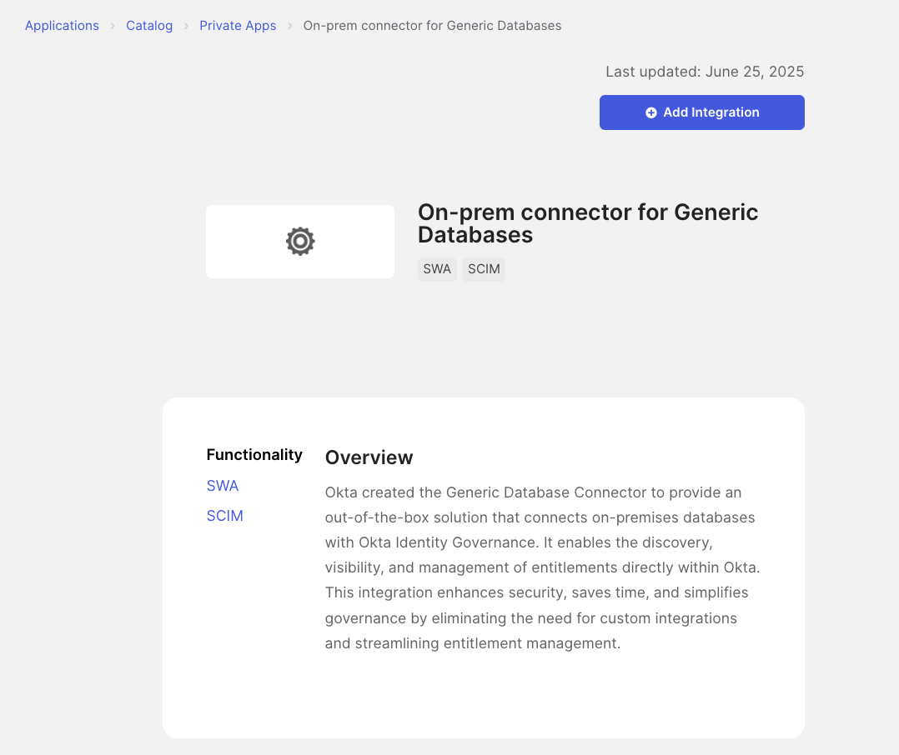

4. **Configure Application Label**
   - Provide a name for the application in the **Application Label** field (Default name: "Generic Database Connector")
   - Check "Do not display application icon to users"
   - Click **Next**

   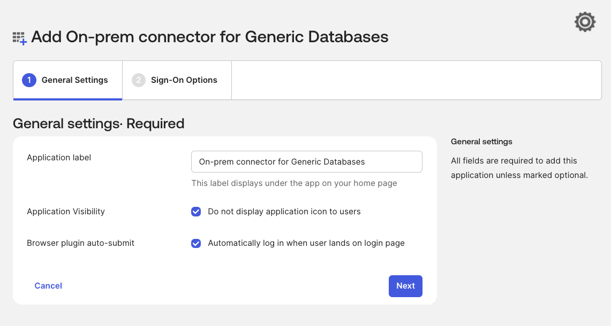

5. **Complete Application Setup**
   - Leave all the other fields as default and click **Done**

6. **Enable Entitlement Management**
   - In the **General** tab, scroll down to the **Entitlement Management** section
   - Click **Edit**
   - From the dropdown menu, select **Enable**
   - Click **Save**

   

   > **Note**: Once entitlement management is enabled, you'll notice that the **Governance** tab now shows additional sub-tabs such as **Entitlements**, **Bundles**, etc.

7. **Enable Provisioning**
   - Navigate to the **Provisioning** tab
   - Click **Enable Provisioning**

   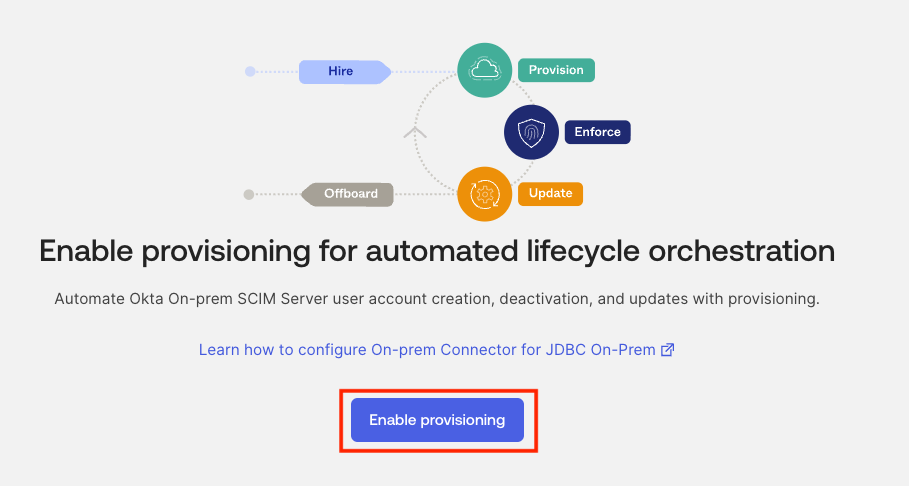

8. **Select OPP Agent**
   - This page displays all available Okta Provisioning Agents (both active and inactive) in your Okta org
   - Select your registered Okta Provisioning Agent `okta-opp` from the list
   - Click **Next**

   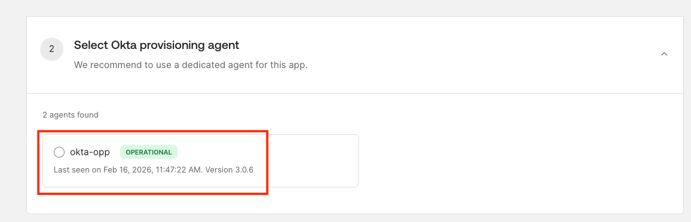

9. **Configure SCIM Server Connection**
   - Enter the **SCIM Hostname**: `okta-scim` (must match the container name for internal connectivity)
   - Enter the **API Token** with the `Bearer` prefix (from SCIM Server credentials)
     - Example: `Bearer d5307740c879491cedecf70c2225776b`

     - > 🔑 **IMPORTANT**: When configuring the Okta application, you **MUST** add the `Bearer` prefix before the token value, with a space between `Bearer` and the token.
   - Click **Add Files** under **Public Key**
   - Upload the certificate file (`.crt`) from the host system `./data/okta-scim/certs/OktaOnPremScimServer-*.crt`
      - Or save in a `.crt` or `.pem` file the certificate extacted with the command:

         ```bash
         docker compose exec okta-scim bash -c 'cat /opt/OktaOnPremScimServer/certs/OktaOnPremScimServer-*.crt'
         ```

   - Click **Next**

      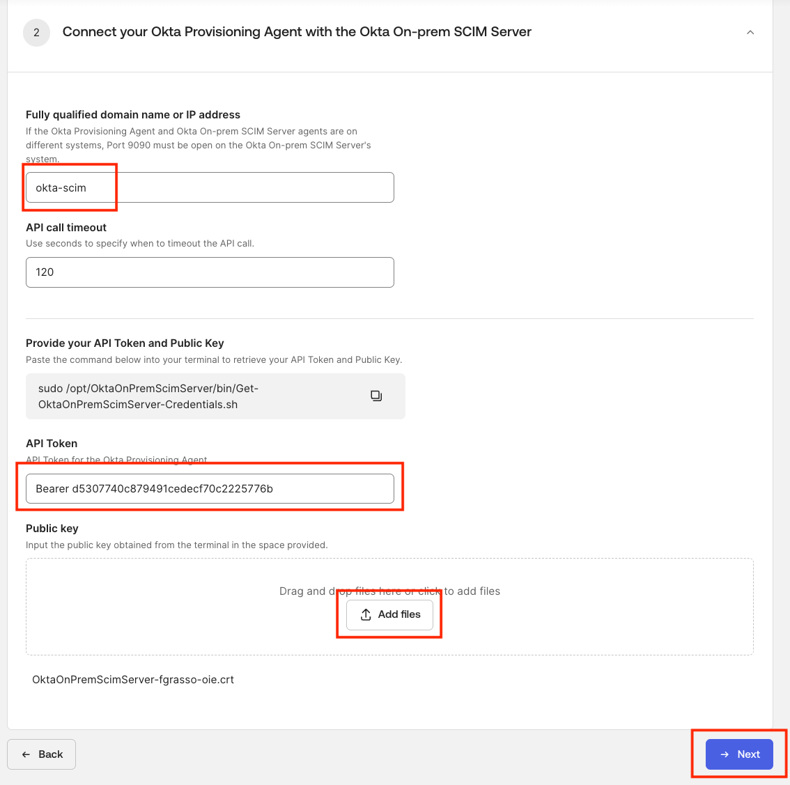

10. **Configure Database Connection**
    - Provide the database connection details (change them if you are not using the default values in your `.env` file):
      - **Username**: `oktademo`
      - **Password**: `oktademo`
      - **Type of Database**: Select `MySQL`
      - **IP/Domain Name**: `db` (must match the container name for internal connectivity)
      - **Port**: `3306`
      - **Database Name**: `oktademo`
      - Add the following additional key/value pair in the **Database Property: Configuration of Key-Value Pairs** section:
        - Key: `allowMultiQueries`
        - Value: `true`
    - Click **Setup Complete**

      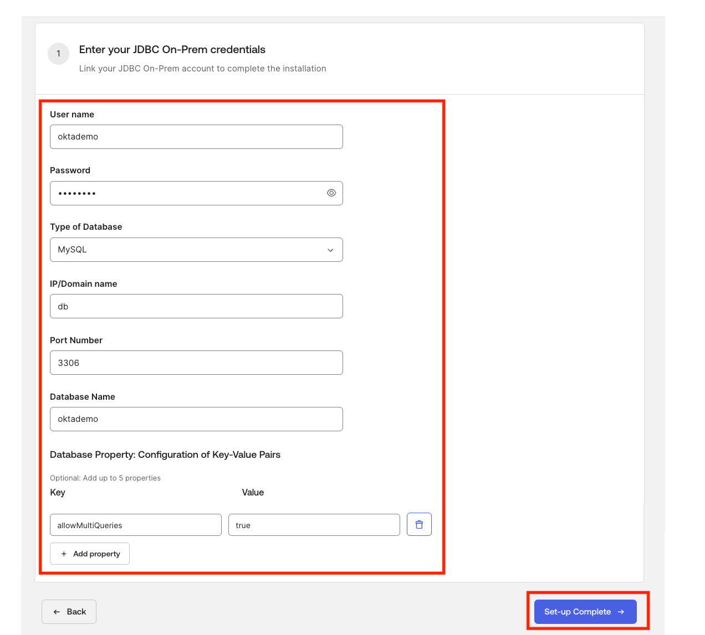

11. You will see a **Connecting agents...** pop-up for a few seconds.

      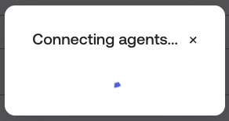

12. **Connection Success**:  Once the connection is successful, you'll be directed to the **Integration** tab of the **Provisioning** section. From here, you can proceed to configure Schema Discovery & Import and Provisioning operations.

> ### 💡 Multi-Database Support
>
> A single OPP Agent and SCIM Server can connect to **up to 8 different databases** simultaneously. This allows you to manage users and entitlements across multiple database systems from a single on-premises infrastructure. Each database connection is configured as a **separate Generic Database Connector application instance** in Okta.

---

## SQL Queries vs Stored Procedures

The Generic Database Connector supports two approaches for configuring database operations:

1. **SQL Statements**: Direct SQL queries (e.g. `SELECT`, `INSERT`, `UPDATE`, `DELETE`)
2. **Stored Procedures**: Pre-compiled database procedures that encapsulate business logic

**This guide provides both options** for each operation, allowing you to choose the approach that best fits your requirements and database architecture.
Stored procedures are pre-configured in [sql/stored_proc.sql](../sql/stored_proc.sql) and are the recommended approach.
You can find more information in the **[Stored Procedures Reference](#stored-procedures-reference)** section at the end of this document.

> 📘 **Stored Procedures** are pre-compiled SQL code blocks stored in the database that can be executed with a single call. They act as reusable functions that encapsulate complex queries and business logic.
>
> **Key Benefits:**
>
> - **Security**: Parameters are automatically handled, preventing SQL injection attacks
> - **Performance**: Pre-compiled and optimized by the database engine
> - **Maintainability**: Centralized logic makes updates easier without changing Okta configuration
> - **Abstraction**: Hides database complexity from the provisioning layer
> - **Consistency**: Ensures the same logic is applied across all operations
> - **Portability**: Easier to migrate to different databases by just rewriting the stored procedures without changing Okta configuration
>
> **Example:**
> Instead of writing: `SELECT * FROM USERS WHERE USER_ID = ?`
> You call: `CALL GET_USER_BY_ID(?)`
>
> The procedure internally handles the query, any data transformations, and - eventually - error handling.

## Configuration Steps

### Import Operations (To Okta)

These operations import data from your database into Okta.

#### Navigate to Import Settings

1. Go to **Okta Admin Console** → **Applications** → **Generic Database Connector**
2. Navigate to the **Provisioning** tab
3. Go to **Integration** → **To Okta**
4. Click **Edit** next to **Schema discovery & Import**

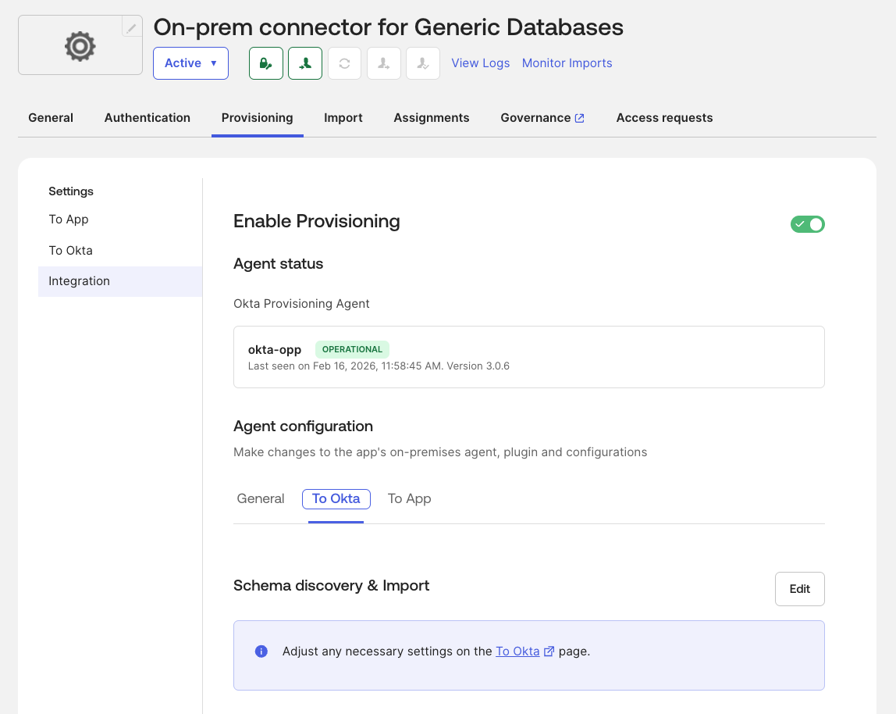

---

#### 1. Get Users

Import all active users from the database.

**Configuration:**

- ✅ Check **Enabled**
- Option 1 - Select **SQL Statement**, and enter the SQL query:

   ```sql
   SELECT USER_ID, USERNAME, FIRSTNAME, LASTNAME, MIDDLENAME, EMAIL, DISPLAYNAME, NICKNAME, MOBILEPHONE, STREETADDRESS, CITY, STATE, ZIPCODE, COUNTRYCODE, TIMEZONE, ORGANIZATION, DEPARTMENT, MANAGERID, MANAGER, TITLE, EMPLOYEENUMBER, HIREDATE, TERMINATIONDATE, PASSWORD_HASH, IS_ACTIVE FROM USERS WHERE IS_ACTIVE = 1
   ```

- Option 2 - Select **Stored Procedure** (Recommended), and enter the stored procedure call:

   ```sql
   CALL GET_ACTIVEUSERS()
   ```

- **User ID Column:** `USER_ID`

💡 **What it does:** Retrieves all active users (where `IS_ACTIVE = 1`) with all fields from the USERS table.

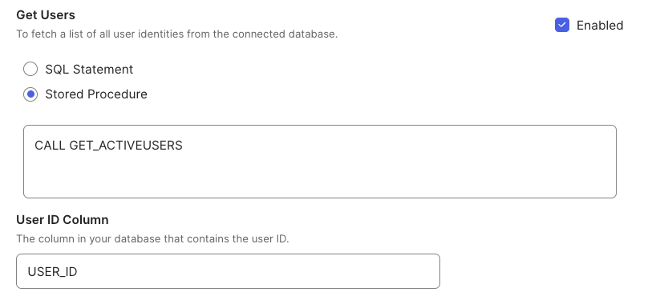

---

#### 2. Get All Entitlements

Import all available entitlements from the database.

**Configuration:**

- ✅ Check **Enabled**
- Option 1 - Select **SQL Statement**, and enter the SQL query:

   ```sql
   SELECT ENT_ID, ENT_NAME, ENT_DESCRIPTION FROM ENTITLEMENTS
   ```

- Option 2 - Select **Stored Procedure** (Recommended), and enter the stored procedure call:

   ```sql
   CALL GET_ALL_ENTITLEMENTS()
   ```

- **Entitlement ID Column:** `ENT_ID`
- **Entitlement Display Column:** `ENT_NAME`

💡 **What it does:** Retrieves all entitlements from the ENTITLEMENTS table (e.g., VPN Access, GitHub Admin, AWS Console).

---

#### 3. Get User by ID

Retrieve specific user details by their USER_ID.

**Configuration:**

- ✅ Check **Enabled**
- Option 1 - Select **SQL Statement**, and enter the SQL query:

   ```sql
   SELECT USER_ID, USERNAME, FIRSTNAME, LASTNAME, MIDDLENAME, EMAIL, DISPLAYNAME, NICKNAME, MOBILEPHONE, STREETADDRESS, CITY, STATE, ZIPCODE, COUNTRYCODE, TIMEZONE, ORGANIZATION, DEPARTMENT, MANAGERID, MANAGER, TITLE, EMPLOYEENUMBER, HIREDATE, TERMINATIONDATE, PASSWORD_HASH, IS_ACTIVE FROM USERS WHERE USER_ID = ?
   ```

- Option 2 - Select **Stored Procedure** (Recommended), and enter the stored procedure call:

   ```sql
   CALL GET_USER_BY_ID(?)
   ```

- **Map Parameters to Fields:**
  - Parameter 1: `DATABASE_FIELD` → `USER_ID`

💡 **What it does:** Queries a specific user from the USERS table using their USER_ID, returning all fields.

---

#### 4. Get User Entitlements

Retrieve all entitlements assigned to a specific user.

**Configuration:**

- ✅ Check **Enabled**
- Option 1 - Select **SQL Statement**, and enter the SQL query:

   ```sql
   SELECT UE.USERENTITLEMENT_ID, UE.USER_ID, U.USERNAME, U.EMAIL, UE.ENT_ID, E.ENT_NAME, E.ENT_DESCRIPTION, UE.ASSIGNEDDATE
   FROM USERENTITLEMENTS UE
   JOIN USERS U ON UE.USER_ID = U.USER_ID
   JOIN ENTITLEMENTS E ON UE.ENT_ID = E.ENT_ID
   WHERE UE.USER_ID = ?
   ```

- Option 2 - Select **Stored Procedure** (Recommended), and enter the stored procedure call:

   ```sql
   CALL GET_USER_ENTITLEMENT(?)
   ```

- **Map Parameters to Fields:**
  - Parameter 1: `DATABASE_FIELD` → `USER_ID`

💡 **What it does:** Queries the USERENTITLEMENTS table to retrieve all entitlements for a user with JOIN to USERS and ENTITLEMENTS tables.

---

### Provisioning Operations (To App)

These operations provision changes from Okta to your database.

#### Navigate to Provisioning Settings

1. Stay in the **Provisioning** tab
2. Go to **Integration** → **To App**
3. Click **Edit** next to **Provisioning**

---

#### 5. Create User

Create a new user in the database when assigned in Okta.

**Configuration:**

- ✅ Check **Enabled**
- Option 1 - Select **SQL Statement**, and enter the SQL query:

   ```sql
   INSERT INTO USERS (USER_ID, USERNAME, FIRSTNAME, LASTNAME, EMAIL, MIDDLENAME, DISPLAYNAME, NICKNAME, MOBILEPHONE, STREETADDRESS, CITY, STATE, ZIPCODE, COUNTRYCODE, TIMEZONE, ORGANIZATION, DEPARTMENT, MANAGERID, MANAGER, TITLE, EMPLOYEENUMBER, HIREDATE, TERMINATIONDATE, PASSWORD_HASH)
   VALUES (?, ?, ?, ?, ?, ?, ?, ?, ?, ?, ?, ?, ?, ?, ?, ?, ?, ?, ?, ?, ?, ?, ?, ?)
   ```

- Option 2 - Select **Stored Procedure** (Recommended), and enter the stored procedure call:

   ```sql
   CALL CREATE_USER(?, ?, ?, ?, ?, ?, ?, ?, ?, ?, ?, ?, ?, ?, ?, ?, ?, ?, ?, ?, ?, ?, ?, ?)
   ```

- **Map Parameters to Fields:**
  - Parameter 1: `DATABASE_FIELD` → `USER_ID` **(required)**
  - Parameter 2: `DATABASE_FIELD` → `USERNAME` **(required)**
  - Parameter 3: `DATABASE_FIELD` → `FIRSTNAME` **(required)**
  - Parameter 4: `DATABASE_FIELD` → `LASTNAME` **(required)**
  - Parameter 5: `DATABASE_FIELD` → `EMAIL` **(required)**
  - Parameter 6: `DATABASE_FIELD` → `MIDDLENAME`
  - Parameter 7: `DATABASE_FIELD` → `DISPLAYNAME`
  - Parameter 8: `DATABASE_FIELD` → `NICKNAME`
  - Parameter 9: `DATABASE_FIELD` → `MOBILEPHONE`
  - Parameter 10: `DATABASE_FIELD` → `STREETADDRESS`
  - Parameter 11: `DATABASE_FIELD` → `CITY`
  - Parameter 12: `DATABASE_FIELD` → `STATE`
  - Parameter 13: `DATABASE_FIELD` → `ZIPCODE`
  - Parameter 14: `DATABASE_FIELD` → `COUNTRYCODE`
  - Parameter 15: `DATABASE_FIELD` → `TIMEZONE`
  - Parameter 16: `DATABASE_FIELD` → `ORGANIZATION`
  - Parameter 17: `DATABASE_FIELD` → `DEPARTMENT`
  - Parameter 18: `DATABASE_FIELD` → `MANAGERID`
  - Parameter 19: `DATABASE_FIELD` → `MANAGER`
  - Parameter 20: `DATABASE_FIELD` → `TITLE`
  - Parameter 21: `DATABASE_FIELD` → `EMPLOYEENUMBER`
  - Parameter 22: `DATABASE_FIELD` → `HIREDATE`
  - Parameter 23: `DATABASE_FIELD` → `TERMINATIONDATE`
  - Parameter 24: `DATABASE_FIELD` → `PASSWORD_HASH`

💡 **What it does:** Inserts a new row into the USERS table with all user attributes. Only USER_ID, USERNAME, FIRSTNAME, LASTNAME, and EMAIL are mandatory; all other fields are optional and can be NULL.

> You can use less parameters if you don't want to populate all fields during user creation. For example, you can choose to only pass the 5 mandatory fields and leave the rest as NULL.

---

#### 6. Update User

Update existing user attributes in the database.

**Configuration:**

- ✅ Check **Enabled**
- Option 1 - Select **SQL Statement**, and enter the SQL query:

   ```sql
   UPDATE USERS
   SET USERNAME = ?, FIRSTNAME = ?, LASTNAME = ?, EMAIL = ?, MIDDLENAME = ?, DISPLAYNAME = ?, NICKNAME = ?, MOBILEPHONE = ?, STREETADDRESS = ?, CITY = ?, STATE = ?, ZIPCODE = ?, COUNTRYCODE = ?, TIMEZONE = ?, ORGANIZATION = ?, DEPARTMENT = ?, MANAGERID = ?, MANAGER = ?, TITLE = ?, EMPLOYEENUMBER = ?, HIREDATE = ?, TERMINATIONDATE = ?, PASSWORD_HASH = ?
   WHERE USER_ID = ?
   ```

- Option 2 - Select **Stored Procedure** (Recommended), and enter the stored procedure call:

   ```sql
   CALL UPDATE_USER(?, ?, ?, ?, ?, ?, ?, ?, ?, ?, ?, ?, ?, ?, ?, ?, ?, ?, ?, ?, ?, ?, ?, ?)
   ```

- **Map Parameters to Fields:**
  - Parameter 1: `DATABASE_FIELD` → `USER_ID` **(required)**
  - Parameter 2: `DATABASE_FIELD` → `USERNAME` **(required)**
  - Parameter 3: `DATABASE_FIELD` → `FIRSTNAME` **(required)**
  - Parameter 4: `DATABASE_FIELD` → `LASTNAME` **(required)**
  - Parameter 5: `DATABASE_FIELD` → `EMAIL` **(required)**
  - Parameter 6: `DATABASE_FIELD` → `MIDDLENAME`
  - Parameter 7: `DATABASE_FIELD` → `DISPLAYNAME`
  - Parameter 8: `DATABASE_FIELD` → `NICKNAME`
  - Parameter 9: `DATABASE_FIELD` → `MOBILEPHONE`
  - Parameter 10: `DATABASE_FIELD` → `STREETADDRESS`
  - Parameter 11: `DATABASE_FIELD` → `CITY`
  - Parameter 12: `DATABASE_FIELD` → `STATE`
  - Parameter 13: `DATABASE_FIELD` → `ZIPCODE`
  - Parameter 14: `DATABASE_FIELD` → `COUNTRYCODE`
  - Parameter 15: `DATABASE_FIELD` → `TIMEZONE`
  - Parameter 16: `DATABASE_FIELD` → `ORGANIZATION`
  - Parameter 17: `DATABASE_FIELD` → `DEPARTMENT`
  - Parameter 18: `DATABASE_FIELD` → `MANAGERID`
  - Parameter 19: `DATABASE_FIELD` → `MANAGER`
  - Parameter 20: `DATABASE_FIELD` → `TITLE`
  - Parameter 21: `DATABASE_FIELD` → `EMPLOYEENUMBER`
  - Parameter 22: `DATABASE_FIELD` → `HIREDATE`
  - Parameter 23: `DATABASE_FIELD` → `TERMINATIONDATE`
  - Parameter 24: `DATABASE_FIELD` → `PASSWORD_HASH`

💡 **What it does:** Updates the USERS table record matching the USER_ID with new attribute values. Only USER_ID, USERNAME, FIRSTNAME, LASTNAME, and EMAIL are mandatory; all other fields are optional and can be NULL.

> You can use less parameters if you don't want to populate all fields during user updates. For example, you can choose to only pass the 5 mandatory fields and leave the rest as NULL.

---

#### 7. Activate User

Activate a user account.

**Configuration:**

- ✅ Check **Enabled**
- Option 1 - Select **SQL Statement**, and enter the SQL query:

   ```sql
   UPDATE USERS SET IS_ACTIVE = 1 WHERE USER_ID = ?
   ```

- Option 2 - Select **Stored Procedure** (Recommended), and enter the stored procedure call:

   ```sql
   CALL ACTIVATE_USER(?)
   ```

- **Map Parameters to Fields:**
  - Parameter 1: `DATABASE_FIELD` → `USER_ID`

💡 **What it does:** Sets `IS_ACTIVE = TRUE` for the specified user in the USERS table.

---

#### 8. Deactivate User

Deactivate a user account.

**Configuration:**

- ✅ Check **Enabled**
- Option 1 - Select **SQL Statement**, and enter the SQL query:

   ```sql
   UPDATE USERS SET IS_ACTIVE = 0 WHERE USER_ID = ?
   ```

- Option 2 - Select **Stored Procedure** (Recommended), and enter the stored procedure call:

   ```sql
   CALL DEACTIVATE_USER(?)
   ```

- **Map Parameters to Fields:**
  - Parameter 1: `DATABASE_FIELD` → `USER_ID`

💡 **What it does:** Sets `IS_ACTIVE = FALSE` for the specified user in the USERS table.

---

#### 9. Add Entitlement to User

Assign an entitlement to a user.

**Configuration:**

- ✅ Check **Enabled**
- Option 1 - Select **SQL Statement**, and enter the SQL query:

   ```sql
   INSERT INTO USERENTITLEMENTS (USER_ID, ENT_ID) VALUES (?, ?)
   ```

- Option 2 - Select **Stored Procedure** (Recommended), and enter the stored procedure call:

   ```sql
   CALL ADD_ENTITLEMENT_TO_USER(?, ?)
   ```

- **Map Parameters to Fields:**
  - Parameter 1: `DATABASE_FIELD` → `USER_ID`
  - Parameter 2: `DATABASE_FIELD` → `ENT_ID`

💡 **What it does:** Inserts a new row into the USERENTITLEMENTS table, creating a user-entitlement mapping.

---

#### 10. Remove Entitlement from User

Revoke an entitlement from a user.

**Configuration:**

- ✅ Check **Enabled**
- Option 1 - Select **SQL Statement**, and enter the SQL query:

   ```sql
   DELETE FROM USERENTITLEMENTS WHERE USER_ID = ? AND ENT_ID = ?
   ```

- Option 2 - Select **Stored Procedure** (Recommended), and enter the stored procedure call:

   ```sql
   CALL REMOVE_ENTITLEMENT_FROM_USER(?, ?)
   ```

- **Map Parameters to Fields:**
  - Parameter 1: `DATABASE_FIELD` → `USER_ID`
  - Parameter 2: `DATABASE_FIELD` → `ENT_ID`

💡 **What it does:** Deletes the row from the USERENTITLEMENTS table matching the user and entitlement.

---

## Configure User Lifecycle Management

The Generic Database Connector application provides a set of features to maintain user lifecycle between Okta and your database. This section explores the options available to configure and streamline automatic provisioning and deprovisioning of users.

### Add Custom Attributes to Application User Profile

Before enabling provisioning configurations, you need to update the attributes for the Generic Database Connector application profile and their mapping to the Okta User profile. Since this application will be importing users with custom attributes into Okta, you need to add those attributes to the application user profile.

> **Note**: For more details on Okta User and Application User profiles, refer to [The Okta User Profile And Application User Profile](https://support.okta.com/help/s/article/The-Okta-User-Profile-And-Application-User-Profile?language=en_US) documentation.

**Steps to Add Attributes:**

1. **Navigate to Profile Editor**
   - In Okta Admin Console, go to **Directory** → **Profile Editor**

2. **Select Generic Database Connector User Profile**
   - Search for **"Generic Database Connector"**
   - Individuate the profile named **"Generic Database Connector User"** and click **Mappings**.

   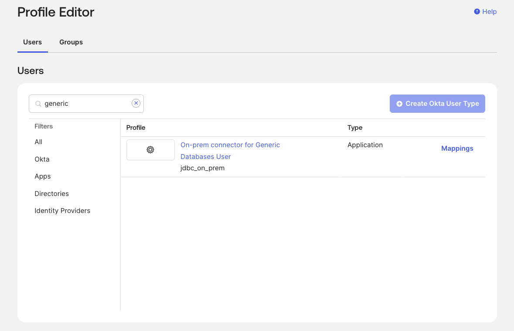

3. **Add Attributes from Database**
   - Under **Attributes**, you'll see that only the **Username** attribute is present
   - Click **+ Add Attribute**

   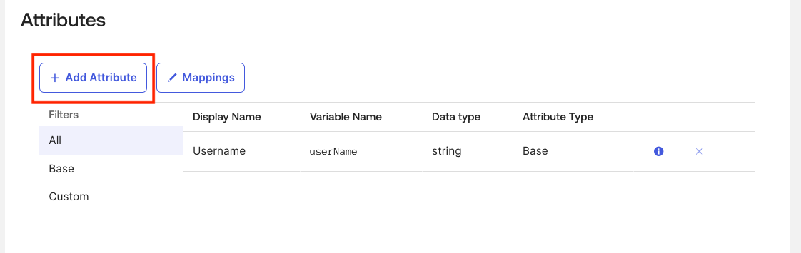

4. **Import Database Attributes**
   - The next page displays all attributes imported from the database
   - Check all the required attributes:
     - `ext_USER_ID`
     - `ext_FIRSTNAME`
     - `ext_LASTNAME`
     - `ext_EMAIL`
     - `ext_MANAGER`
     - `ext_TITLE`
     - And any other custom attributes (you can click the first checkbox to select all)
     - You can click the first box at the top to select all
   - Click **Save**

   

5. **Verify Attributes**
   - The Generic Database Connector user profile now contains all attributes needed for provisioning operations

---

### Mapping User Attributes

Attribute mapping must be configured for both directions:

- **Generic Database Connector User → Okta User** (for imports)
- **Okta User → Generic Database Connector User** (for provisioning)

#### Generic Database Connector User to Okta User

This mapping governs how user accounts from the database are imported into Okta.

**Configuration Steps:**

1. **Navigate to Mappings**
   - Within the **Generic Database Connector User** profile, click **Mappings**

      

2. **Configure Import Mappings**
   - By default, **Generic Database Connector User to Okta User** is selected
   - You'll see that mapping for `login` is present, but others are empty
   - Set up mappings for additional attributes as needed

3. **Map Attributes**
   - Under **Okta User Profile**, click the dropdown in **Choose an attribute or enter an expression**
   - Select the corresponding attribute from **Generic Database Connector User Profile**

   Example mappings:
   - `appuser.ext_FIRSTNAME` → `firstName`
   - `appuser.ext_LASTNAME` → `lastName`
   - `appuser.ext_EMAIL` → `email`
   - `appuser.ext_TITLE` → `title`
   - `appuser.ext_MANAGER` → `managerId`

   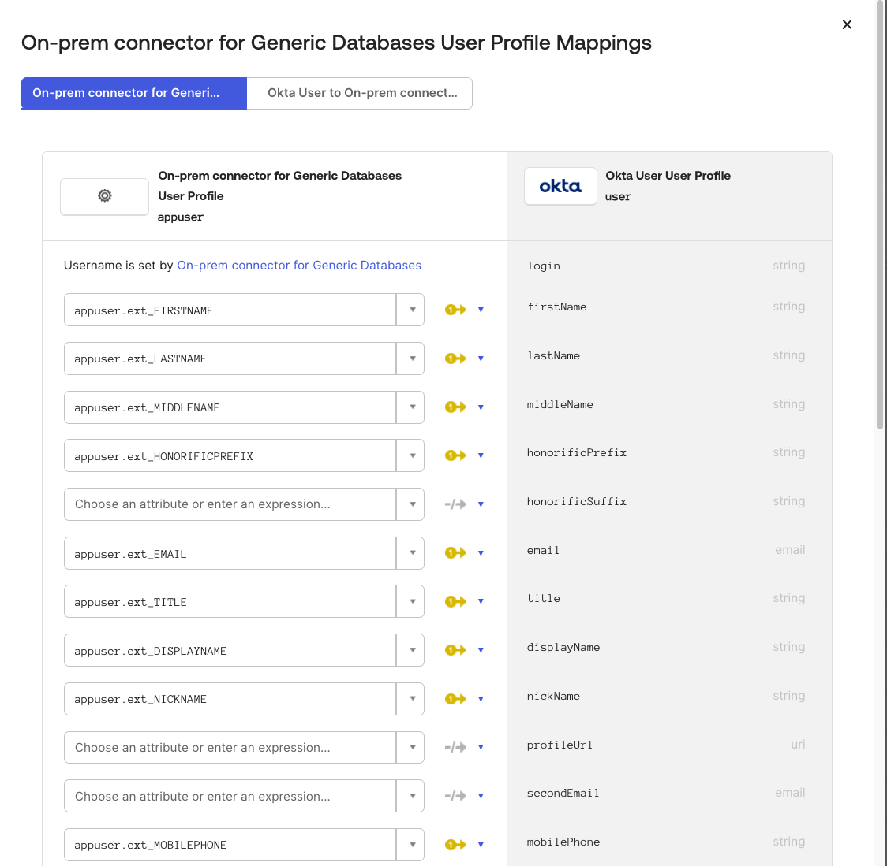

4. **Save Mappings**
   - Click **Save**
   - Click **Apply updates**

#### Okta User to Generic Database Connector User

This mapping dictates how user attributes in Okta correlate with the database user profile, facilitating user creation or modification in the database.

**Configuration Steps:**

1. **Navigate to Mappings**
   - Within the **Generic Database Connector User** profile, click **Mappings**

2. **Select Okta User to Generic Database Connector User**
   - Click **Okta User to Generic Database Connector User**

   

3. **Map Attributes**
   - Click the dropdown under **Choose an attribute or enter an expression**
   - Select the appropriate attributes from **Okta User Profile**

   Example mappings:
   - `login` → `ext_USER_ID`
   - `login` → `ext_USERNAME`
   - `firstName` → `ext_FIRSTNAME`
   - `lastName` → `ext_LASTNAME`
   - `email` → `ext_EMAIL`
   - `managerId` → `ext_MANAGER`
   - `title` → `ext_TITLE`

   

4. **Save Mappings**
   - Click **Save Mappings**

---

### Import & Provisioning

Now that profile mappings are configured, you can enable import and provisioning features.

#### Setup Provisioning to Database

1. **Navigate to Provisioning Settings**
   - In Okta Admin Console, go to **Applications** → **Generic Database Connector**
   - Click the **Provisioning** tab
   - Navigate to **Settings** → **To App**

2. **Edit Provisioning Settings**
   - Click **Edit** in the **Provisioning to App** section

3. **Enable Provisioning Features**
   - ✅ **Create Users**: Enable to create users in the database when assigned in Okta
   - ✅ **Update User Attributes**: Enable to sync attribute changes from Okta to database
   - ✅ **Deactivate Users**: Enable to deactivate users in database when unassigned from Okta

4. **Save Configuration**
   - Click **Save**

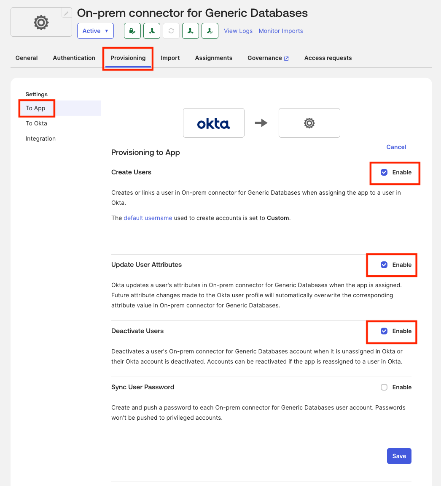

#### Setup Import from Database

The Generic Database Connector provides functionality to import users from the database into Okta.

**Configuration Steps:**

1. **Navigate to Import Settings**
   - Go to **Applications** → **Generic Database Connector**
   - Click **Provisioning** tab
   - Navigate to **Settings** → **To Okta**
   - Click **Edit** next to **General**

2. **Configure Import Schedule**
   - Under **Full Import Schedule**, select the desired frequency for importing users (e.g., every 6 hours)
   - Do not configure **Incremental Import Schedule** as the database does not have a timestamp field to track changes

3. **Configure Okta Username Format**
   - Under **Okta username format**, select **Custom** from the dropdown
   - Enter: `appuser.ext_EMAIL` in the textbox
   - This ensures usernames are in email format using the `appuser.ext_USERNAME` attribute

4. **Save Configuration**
   - Click **Save**

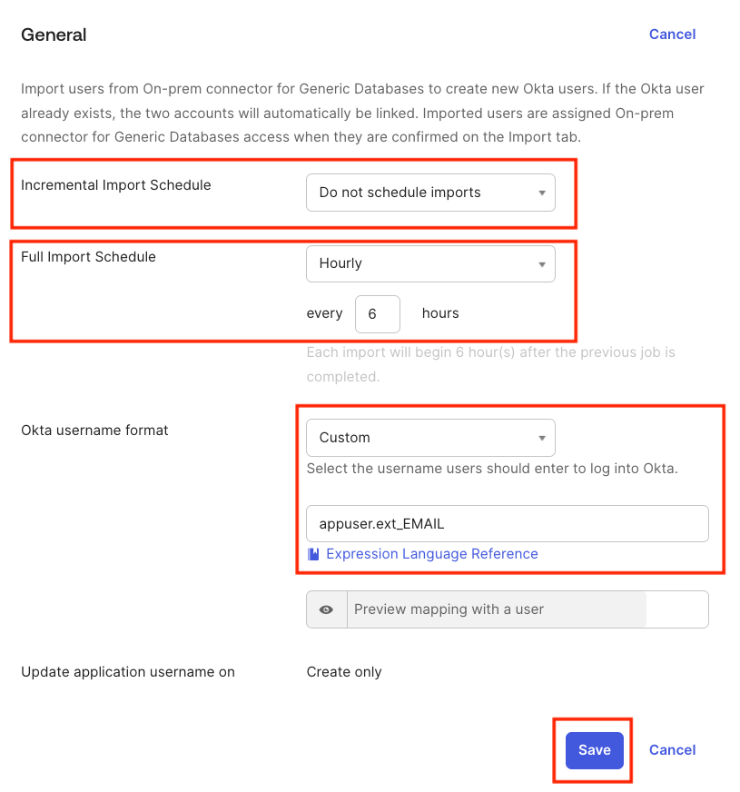
> TODO Rifare screenshot

#### Execute Manual Import

After configuring import settings, you can manually import users from the database to test the integration.

**Steps:**

1. **Navigate to Import Tab**
   - Go to **Applications** → **Generic Database Connector**
   - Click the **Import** tab

2. **Start Import**
   - Click **Import Now**
   - Select **Full Import**
   - Click **Import**

   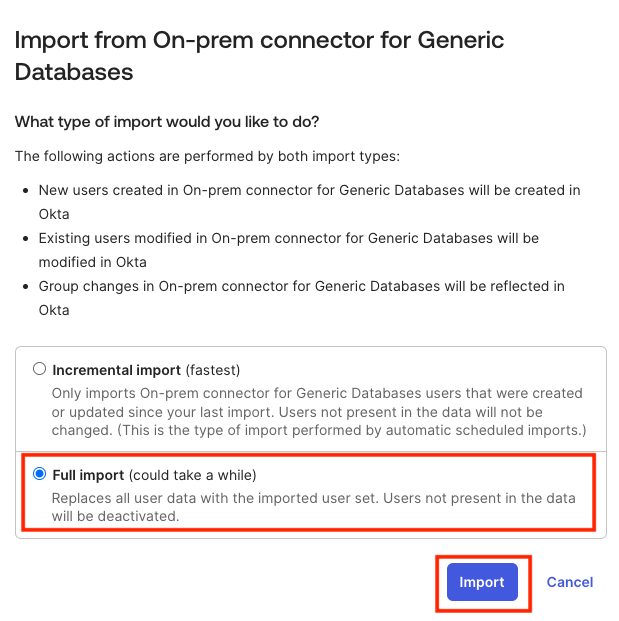

3. **Review Import Results**
   - Once import completes, you'll see an **Import Success** message
   - Review the list of users imported from the database

   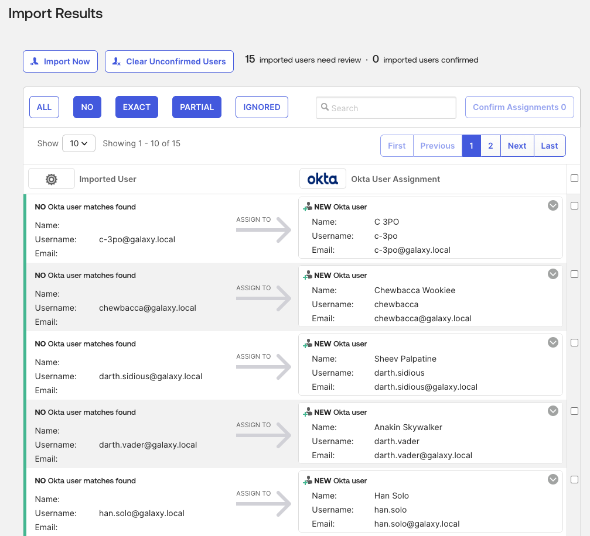

4. **Confirm User Assignments**
   - By default, imported users require manual confirmation (configurable in *Provisioning → To Okta → User Creation & Matching*)
   - Select the users you want to import into Okta
   - Click **Confirm Assignments**
   - Select **Auto-activate users after confirmation**
   - Click **Confirm** when prompted

   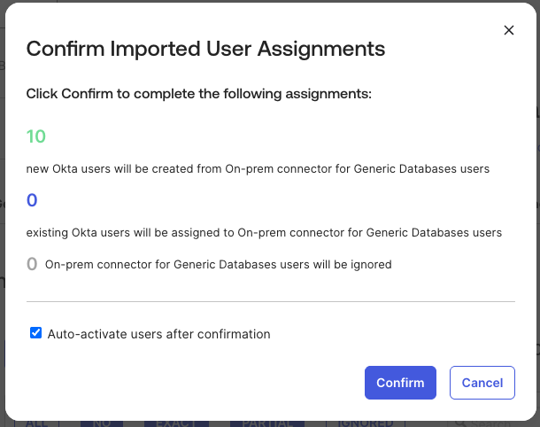

5. **Verify Imported Users**
   - Navigate to the **Assignments** tab
   - Verify that imported users are now visible

   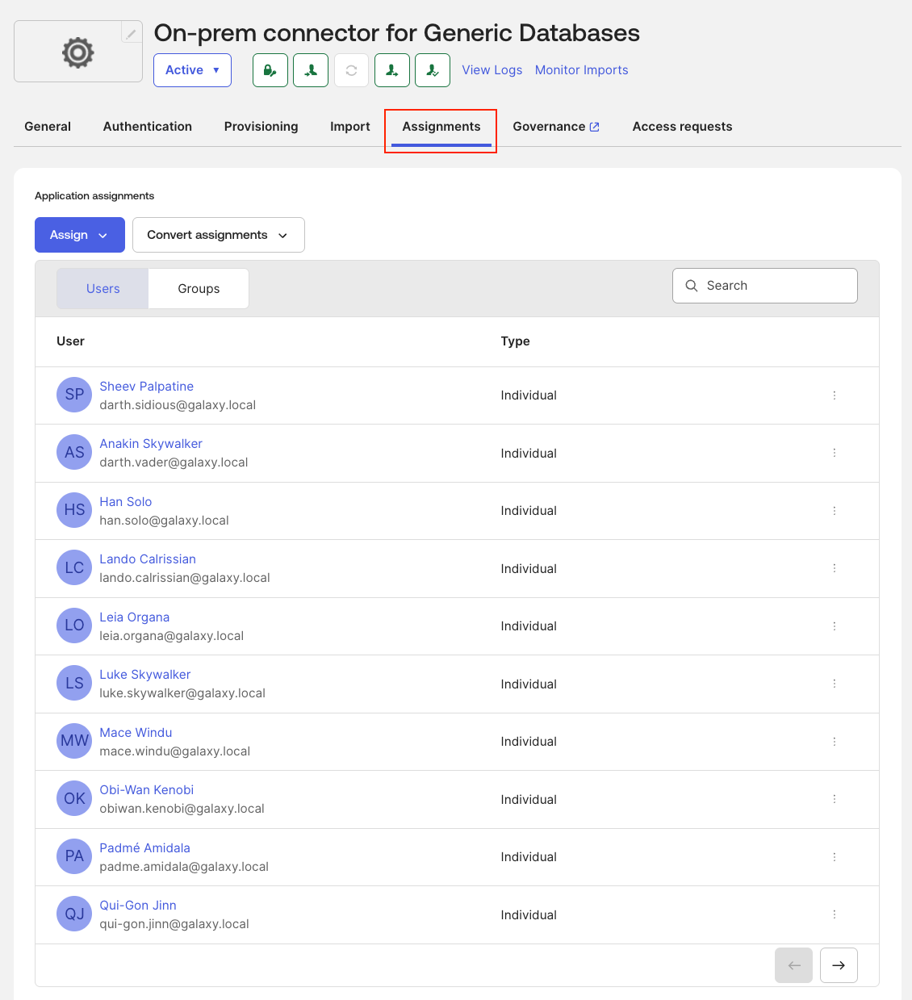

---

## Check the entitlements sync

After configuring the provisioning operations, you can verify that entitlements are syncing correctly between Okta and your database.

1. **Check entitlement in Okta app profile**:
   - Click the **Governance** tab
   - Click **Entitlements**
   - Verify that the entitlements from the database are listed in Okta

      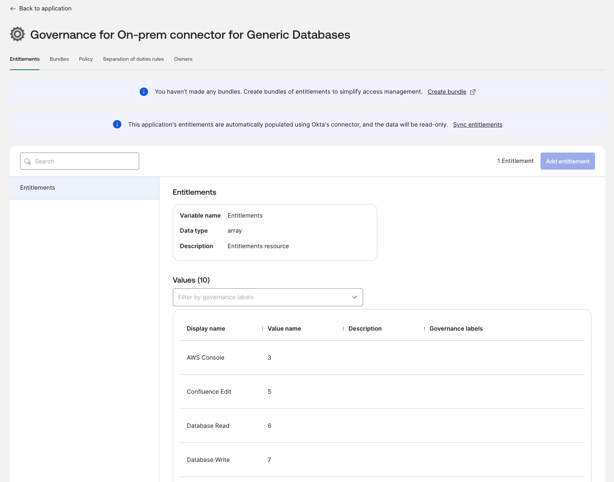

   - Notes:
      - At the moment only the **Display Name** and **Value Name** of the entitlement are supported. The **Description** is not yet included in the list
      - To define the **Governance Label** refer to the Okta documentation (TODO link)
      - Despite other application integrated with the Okta Governance, at the moment the Database Connector **support only one entitlement type** per each application instance.

1. **Check user entitlements**:
   - Click on the three dots next to the user you just imported in the **Assignments** tab
   - Click **View access details**

      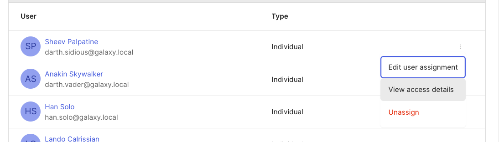

   - Verify that the entitlements assigned to the user in the database are reflected in Okta

      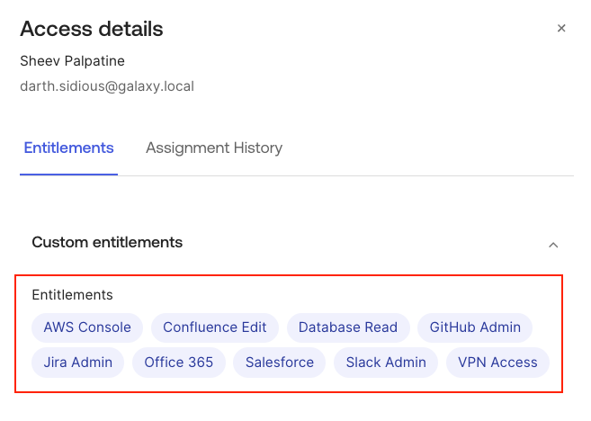

---

## Testing

Now that the Generic Database Connector application is integrated and configured, you can test its capabilities.

### Test #1: Manual User Assignment

In this test, an Okta Administrator assigns a user to the Generic Database Connector application and grants entitlements. The user should be created in the database with the assigned entitlements reflected.

**Steps:**

1. **Assign User to Application**
   - Log on to **Okta Admin Console**
   - Navigate to **Applications** → **Generic Database Connector**
   - Click the **Assignments** tab
   - Click **Assign** → **Assign to People**

2. **Select User**
   - Search for a user (e.g., `testuser@example.com`)
   - Click **Assign** next to the user

3. **Review User Details**
   - The application auto-populates custom attribute values based on your mappings
   - Review and adjust values as needed - Empty fields can be manually entered
   - Click **Assign and Continue**  

   

4. **Assign Entitlements**
   - In the **Select Assignment** section, select **Custom Values** from the **Entitlement assignment method**  dropdown
   - Under **Entitlements**, select desired entitlements (e.g., "VPN Access", "GitHub Admin")
   - Click **Save**
   (TODO SCREENSHOT)

5. **Verify in Okta**
   - The user should now appear under the **Assignments** tab
   - Click the menu button (three vertical dots) next to the user
   - Select **View access details** to see assigned entitlements

6. **Verify in Database**
   - Check that the user was created in the database:

     ```bash
     docker compose exec db mariadb -u oktademo -poktademo oktademo -e "SELECT USER_ID,USERNAME,FIRSTNAME,LASTNAME,EMAIL FROM USERS WHERE EMAIL='testuser@example.com';"

     # SAMPLE OUTPUT
     #  +----------------------+-----------+-----------+----------+----------------------+
     # | USER_ID              | USERNAME  | FIRSTNAME | LASTNAME | EMAIL                |
     # +----------------------+-----------+-----------+----------+----------------------+
     # | testuser@example.com | test.user | Test      | User     | testuser@example.com |
     # +----------------------+-----------+-----------+----------+----------------------+
     ```

     You can also verify with DBGate UI, by opening the `USERS` table.

     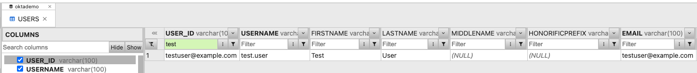

7. **Verify Entitlements in Database**
   - Check that entitlements were assigned:

      ```bash
      docker compose exec db mariadb -u oktademo -poktademo oktademo -e "CALL GET_USER_ENTITLEMENT('testuser@example.com');"
      ```

      You can also verify with DBGate UI, by opening the `USERENTITLEMENTS` table or the `v_userentitlements` view.

      

---

### Test #2: User Attribute Update

Test that attribute changes in Okta are synchronized to the database.

**Steps:**

1. **Update User in Okta**
   - Navigate to **Directory** → **People**
   - Find and select a user (e.g., `testuser@example.com`)
   - Click **Profile** → **Edit**
   - Change an attribute (e.g., `title`, `department`)
   - Click **Save**

2. **Verify in Database**
   - Check that changes were synced:

     ```bash
     docker compose exec db mariadb -u oktademo -poktademo oktademo \
       -e "SELECT USER_ID, TITLE, DEPARTMENT, EMAIL FROM USERS WHERE EMAIL='testuser@example.com';"
     ```

     You can also verify with DBGate UI, by opening the `USERS` table.

---

### Test #3: User Deactivation

Test that unassigning a user from the application deactivates them in the database.

**Steps:**

1. **Unassign User**
   - Navigate to **Applications** → **Generic Database Connector** → **Assignments**
   - Find the user and click the menu button
   - Select **Unassign**
   - Confirm the action

2. **Verify Deactivation in Database**
   - Check that the user's `IS_ACTIVE` flag is set to `0`:

     ```bash
     docker compose exec db mariadb -u oktademo -poktademo oktademo \
       -e "SELECT USER_ID, EMAIL, IS_ACTIVE FROM USERS WHERE EMAIL='testuser@example.com';"
     ```

     You can also verify with DBGate UI, by opening the `USERS` table or the `v_inactive_users` view.

---

### Test #4: Import Users from Database

Test importing existing users from the database into Okta.

**Steps:**

1. **Add Test User to Database**
   - Create a test user directly in the database:

      ```bash
      docker compose exec db mariadb -u oktademo -poktademo oktademo -e \
         "CALL CREATE_USER('test.import@galaxy.local', 'test.import', 'Test', 'Import', NULL, NULL, 'test.import@galaxy.local', 'Test Import', NULL, NULL, NULL, NULL, NULL, NULL, NULL, NULL, NULL, 'TEST-DEPT', NULL, NULL, NULL, NULL, NULL, NULL, 'Test User', NULL, NULL, NULL, '9999');"
      ```

      or add a new line with DBGate UI, by opening the `USERS` table.

      This creates a user with mandatory fields (USER_ID, USERNAME, FIRSTNAME, LASTNAME, EMAIL) and a few optional fields (DISPLAYNAME, DEPARTMENT, TITLE, EMPLOYEENUMBER). All other fields are NULL.

2. **Run Import**
   - Navigate to **Applications** → **Generic Database Connector** → **Import**
   - Click **Import Now** → **Full Import** → **Import**

3. **Confirm Import**
   - Review imported users
   - Select the new test user
   - Click **Confirm Assignments** → **Confirm**

4. **Verify in Okta**
   - Navigate to **Directory** → **People**
   - Search for `test.import@galaxy.local`
   - Verify the user was imported with correct attributes

5. **Assign Entitlements**
   - Navigate to **Applications** → **Generic Database Connector** → **Assignments**
   - Find the imported user and click the menu button
   - Select **View access details**
   - Click **Edit Assignments**
   - Assign entitlements as needed
   - Click **Save**

6. **Verify Entitlements in Database**
   - Check that entitlements were assigned:

      ```bash
      docker compose exec db mariadb -u oktademo -poktademo oktademo -e "CALL GET_USER_ENTITLEMENT('test.import@galaxy.local');"
      ```

      You can also verify with DBGate UI, by opening the `USERENTITLEMENTS` table.

---

### Test #5 Check Okta and local logs

To better understand the process and the link between all the component, you can also check the Okta and local logs.

#### Okta Logs

(TODO)

#### OPP Agent Logs

You will find the OPP Agent logs mounted in the local folder `./data/okta-opp/logs/*.log`

#### SCIM Server Logs

You will find the SCIM server logs mounted in the local folder `./data/okta-scim/logs/*.log`

---

## Other Governance Use Cases

Once you have the Generic Database Connector set up, you can explore additional use cases such as:

- **Entitlements Policies**: Define policies in Okta to govern how entitlements are assigned based on user attributes (e.g., department, location). Documentation: [Okta Help - Create an Entitlement Policy](https://help.okta.com/oie/en-us/content/topics/governance/policies/entitlement-policy-create.htm).

- **Access Requests**: Use Okta's Access Request feature to allow users to request entitlements, with approval workflows and automated provisioning. Documentation: [Okta Help - Access Requests](https://help.okta.com/oie/en-us/content/topics/governance/access-requests.htm).

- **Access Certification Campaigns**: Implement one time or periodic access reviews for entitlements to ensure compliance and recertification. Documentation: [Okta Help - Access Certification](https://help.okta.com/oie/en-us/content/topics/governance/access-certification.htm).

---

## Database Schema Reference

This configuration uses the following database tables:

| Table | Description | Fields |
| ----- | ----------- | ------ |
| **USERS** | Comprehensive user profiles | `USER_ID` (PK), `USERNAME` (UNIQUE), `FIRSTNAME`, `LASTNAME`, `MIDDLENAME`, `EMAIL`, `DISPLAYNAME`, `NICKNAME`, `MOBILEPHONE`, `STREETADDRESS`, `CITY`, `STATE`, `ZIPCODE`, `COUNTRYCODE`, `TIMEZONE`, `ORGANIZATION`, `DEPARTMENT`, `MANAGERID`, `MANAGER`, `TITLE`, `EMPLOYEENUMBER`, `HIREDATE`, `TERMINATIONDATE`, `PASSWORD_HASH`, `IS_ACTIVE` |
| **ENTITLEMENTS** | Available entitlements | `ENT_ID` (PK), `ENT_NAME`, `ENT_DESCRIPTION` |
| **USERENTITLEMENTS** | User-entitlement mappings | `USERENTITLEMENT_ID` (PK), `USER_ID` (FK), `ENT_ID` (FK), `ASSIGNEDDATE` |

- **Mandatory USERS fields**: `USER_ID`, `USERNAME`, `FIRSTNAME`, `LASTNAME`, `EMAIL`
- **Optional USERS fields**: All other 20 fields can be NULL

> 💡 The lab includes **15 test users** (Star Wars characters) with pre-configured entitlements.

### Database Diagram

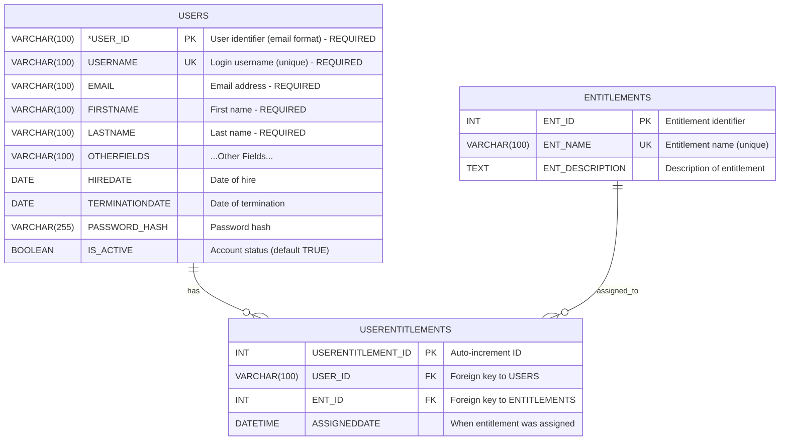
```mermaid
erDiagram
    USERS ||--o{ USERENTITLEMENTS : "has"
    ENTITLEMENTS ||--o{ USERENTITLEMENTS : "assigned_to"
    
    USERS {
        VARCHAR(100) *USER_ID PK "User identifier (email format) - REQUIRED"
        VARCHAR(100) USERNAME UK "Login username (unique) - REQUIRED"
        VARCHAR(100) EMAIL "Email address - REQUIRED"
        VARCHAR(100) FIRSTNAME "First name - REQUIRED"
        VARCHAR(100) LASTNAME "Last name - REQUIRED"
        VARCHAR(100) OTHERFIELDS "...Other Fields..."
        DATE HIREDATE "Date of hire"
        DATE TERMINATIONDATE "Date of termination"
        VARCHAR(255) PASSWORD_HASH "Password hash"
        BOOLEAN IS_ACTIVE "Account status (default TRUE)"
    }
    
    ENTITLEMENTS {
        INT ENT_ID PK "Entitlement identifier"
        VARCHAR(100) ENT_NAME UK "Entitlement name (unique)"
        TEXT ENT_DESCRIPTION "Description of entitlement"
    }
    
    USERENTITLEMENTS {
        INT USERENTITLEMENT_ID PK "Auto-increment ID"
        VARCHAR(100) USER_ID FK "Foreign key to USERS"
        INT ENT_ID FK "Foreign key to ENTITLEMENTS"
        DATETIME ASSIGNEDDATE "When entitlement was assigned"
    }
```

---

## Stored Procedures Reference

All stored procedures are defined in `sql/stored_proc.sql`:

| Procedure | Parameters | Purpose |
| --------- | ---------- | ------- |
| `GET_ACTIVEUSERS()` | None | Retrieve all active users (all fields) |
| `GET_ALL_ENTITLEMENTS()` | None | Retrieve all entitlements |
| `GET_USER_BY_ID(p_user_id)` | p_user_id | Get specific user details (all fields) |
| `GET_USER_ENTITLEMENT(p_user_id)` | p_user_id | Get user's entitlements with username |
| `CREATE_USER(...)` | Various | Create new user with all fields |
| `UPDATE_USER(...)` | Various | Update existing user with all fields |
| `ACTIVATE_USER(p_user_id)` | p_user_id | Activate user account |
| `DEACTIVATE_USER(p_user_id)` | p_user_id | Deactivate user account |
| `ADD_ENTITLEMENT_TO_USER(...)` | p_user_id, p_ent_id | Assign entitlement |
| `REMOVE_ENTITLEMENT_FROM_USER(...)` | p_user_id, p_ent_id | Revoke entitlement |

**Note**: `CREATE_USER` and `UPDATE_USER` procedures support all user fields. Only `USER_ID`, `USERNAME`, `FIRSTNAME`, `LASTNAME`, and `EMAIL` are mandatory. All other fields are optional and can be passed as NULL.

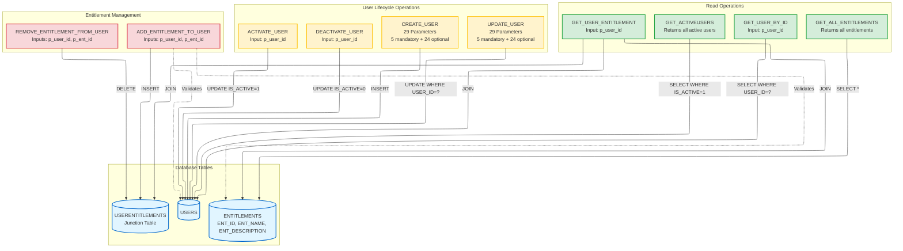
```mermaid
---
config:
  layout: elk
---
flowchart TB
 subgraph s1["Database Tables"]
        USERENTITLEMENTS[("USERENTITLEMENTS<br>Junction Table")]
        ENTITLEMENTS[("ENTITLEMENTS<br>ENT_ID, ENT_NAME, ENT_DESCRIPTION")]
        USERS[("USERS")]
  end
 subgraph s2["Read Operations"]
        GET_USER_ENTITLEMENT["GET_USER_ENTITLEMENT<br>Input: p_user_id"]
        GET_ALL_ENTITLEMENTS["GET_ALL_ENTITLEMENTS<br>Returns all entitlements"]
        GET_USER_BY_ID["GET_USER_BY_ID<br>Input: p_user_id"]
        GET_ACTIVEUSERS["GET_ACTIVEUSERS<br>Returns all active users"]
  end
 subgraph s3["User Lifecycle Operations"]
        DEACTIVATE_USER["DEACTIVATE_USER<br>Input: p_user_id"]
        ACTIVATE_USER["ACTIVATE_USER<br>Input: p_user_id"]
        UPDATE_USER["UPDATE_USER<br>29 Parameters<br>5 mandatory + 24 optional"]
        CREATE_USER["CREATE_USER<br>29 Parameters<br>5 mandatory + 24 optional"]
  end
 subgraph s4["Entitlement Management"]
        REMOVE_ENTITLEMENT["REMOVE_ENTITLEMENT_FROM_USER<br>Inputs: p_user_id, p_ent_id"]
        ADD_ENTITLEMENT["ADD_ENTITLEMENT_TO_USER<br>Inputs: p_user_id, p_ent_id"]
  end
    GET_ACTIVEUSERS -- "SELECT WHERE IS_ACTIVE=1" --> USERS
    GET_USER_BY_ID -- "SELECT WHERE USER_ID=?" --> USERS
    GET_ALL_ENTITLEMENTS -- SELECT * --> ENTITLEMENTS
    GET_USER_ENTITLEMENT -- JOIN --> USERENTITLEMENTS & USERS & ENTITLEMENTS
    CREATE_USER -- INSERT --> USERS
    UPDATE_USER -- "UPDATE WHERE USER_ID=?" --> USERS
    ACTIVATE_USER -- "UPDATE IS_ACTIVE=1" --> USERS
    DEACTIVATE_USER -- "UPDATE IS_ACTIVE=0" --> USERS
    ADD_ENTITLEMENT -- INSERT --> USERENTITLEMENTS
    ADD_ENTITLEMENT -. Validates .-> USERS & ENTITLEMENTS
    REMOVE_ENTITLEMENT -- DELETE --> USERENTITLEMENTS

     USERS:::tableStyle
     ENTITLEMENTS:::tableStyle
     USERENTITLEMENTS:::tableStyle
     GET_ACTIVEUSERS:::readStyle
     GET_USER_BY_ID:::readStyle
     GET_ALL_ENTITLEMENTS:::readStyle
     GET_USER_ENTITLEMENT:::readStyle
     CREATE_USER:::lifecycleStyle
     UPDATE_USER:::lifecycleStyle
     ACTIVATE_USER:::lifecycleStyle
     DEACTIVATE_USER:::lifecycleStyle
     ADD_ENTITLEMENT:::entitlementStyle
     REMOVE_ENTITLEMENT:::entitlementStyle
    classDef tableStyle fill:#e1f5ff,stroke:#0066cc,stroke-width:2px
    classDef readStyle fill:#d4edda,stroke:#28a745,stroke-width:2px
    classDef lifecycleStyle fill:#fff3cd,stroke:#ffc107,stroke-width:2px
    classDef entitlementStyle fill:#f8d7da,stroke:#dc3545,stroke-width:2px
```

---

## Troubleshooting

### Common Issues

#### ValidationException: executeCall not allowed / execute not allowed

If you see this error:

```txt
Error code: 400, error: . Errors received from SCIM server by the connector :
{"schemas":["urn:ietf:params:scim:api:messages:2.0:Error"],"scimType":"INVALID_SYNTAX",
"detail":"statement=CALL ACTIVATE_USER(?), errors=[ValidationException: executeCall not allowed.,
ValidationException: execute not allowed.]","status":400}
```

The operation is configured as "**SQL Statement**" instead of "**Execute Stored Procedure**".

1. Go to Okta Admin Console → Applications → Generic Database Connector
2. Navigate to the Provisioning tab → To App / To Okta → Edit
3. For each operation that calls a stored procedure, ensure **Operation Type** is set to **"Execute Stored Procedure"** (NOT "SQL Statement")

#### Stored Procedure Not Found

- Verify procedures are installed: `docker compose exec db mariadb -u oktademo -poktademo oktademo -e "SHOW PROCEDURE STATUS WHERE Db='oktademo';"`
- Reinitialize database if needed (see README.md)

#### Parameter Mismatch

- Ensure parameter count matches the stored procedure definition
- Check parameter types (DATABASE_FIELD, CURSOR, etc.)
- Review `sql/stored_proc.sql` for exact signatures

#### Connection Timeout

- Verify SCIM server is running: `docker compose ps okta-scim`
- Check database connectivity: `docker compose exec okta-scim mysql -h db -u oktademo -poktademo oktademo -e "SELECT 1;"`

#### Entitlement Operations Failing

- Verify ENT_ID exists: `SELECT * FROM ENTITLEMENTS;`
- Check foreign key constraints
- Review USERENTITLEMENTS table structure

### Debug Mode

Enable debug logging in SCIM Server:

1. Edit `.env` file`
2. Add or modify:

      ```properties
      LOG_LEVEL_OKTA_SCIM=DEBUG
      LOG_LEVEL_SPRING_JDBC=DEBUG
      ```

3. Restart SCIM container: `docker compose restart okta-scim`

---

## Additional Resources

- [Project README](../README.md)
- [Quick Start Guide](../QUICKSTART.md)
- [Stored Procedures Source](../sql/stored_proc.sql)
- [Database Schema](../sql/init.sql)
- [Generic Database Connector Okta Documentation](https://help.okta.com/oie/en-us/content/topics/provisioning/opc/connectors/on-prem-connector-generic-db.htm)
- [Okta SCIM Server Technical Documentation](../doc/Okta_SCIM_Server.md) - Advanced technical reference for SCIM Server internals (*reverse-engineered, educational purposes only*)
- [Okta Identity Governance Documentation](https://help.okta.com/oie/en-us/content/topics/governance/)
- [Okta Lifecycle Management Documentation](https://help.okta.com/oie/en-us/content/topics/provisioning)

---

**Note**: This configuration is designed for the lab environment. For production deployments, review and adjust stored procedures and all the configurations according to your security and compliance requirements.
